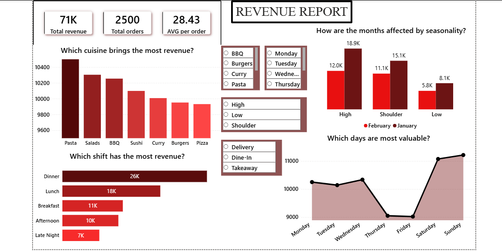
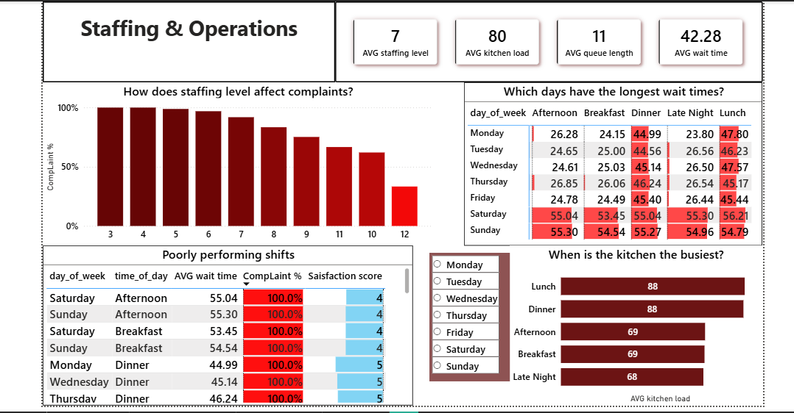
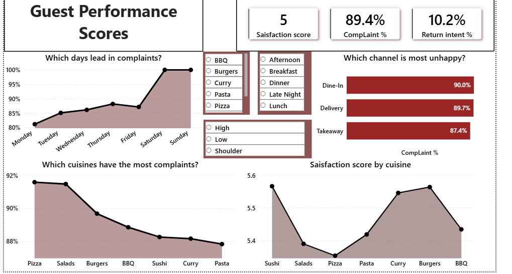
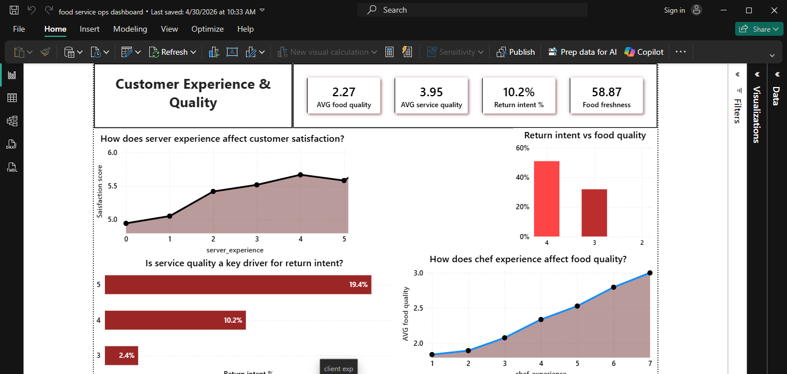

# Hotel Food Service Operational Intelligence Dashboard

## Project Overview

This project analyzes hotel food service operations using transactional and service-performance data to identify what drives revenue, customer satisfaction, complaints, return intent, and staffing efficiency.

The objective was to transform raw hospitality operations data into an executive dashboard that helps restaurant and hotel managers make better decisions around staffing, service quality, menu performance, and peak-period planning.

This project was designed as a practical hospitality analytics case study.

---

## Business Questions Answered

### Revenue & Commercial Performance
- Which cuisines generate the highest revenue?
- Which shifts produce the most revenue?
- How do seasonal demand periods affect monthly revenue?
- Which days of the week are most valuable?

### Staffing & Operations
- How does staffing level affect complaint rates?
- Which days and shifts have the longest waiting times?
- Which shifts are operationally underperforming?
- When is the kitchen busiest?

### Guest Performance
- Which days generate the most complaints?
- Which service channels have the highest complaint rates?
- Which cuisines perform worst on complaints?
- Which cuisines achieve the highest satisfaction scores?

### Customer Experience & Quality
- How does server experience affect customer satisfaction?
- How does chef experience affect food quality?
- Is service quality a driver of return intent?
- Which quality metrics most influence repeat business?

---

## Tools Used

- SQL (data preparation, KPI calculations, operational analysis)
- Microsoft Power BI (dashboard design and reporting)
- Power Query (data cleaning and date transformations)
- GitHub

---

## Dashboard Structure

### Page 1 — Revenue Report
Executive revenue dashboard focused on:

- Total Revenue
- Total Orders
- Average Revenue Per Order
- Revenue by Cuisine
- Revenue by Shift
- Seasonality Impact
- Highest Value Days

### Page 2 — Staffing & Operations
Operational performance dashboard focused on:

- Average Staffing Level
- Kitchen Load
- Queue Length
- Waiting Time
- Complaint Rate by Staffing Level
- Longest Wait Time Days/Shifts
- Poorly Performing Shifts

### Page 3 — Guest Performance Scores
Guest outcome dashboard focused on:

- Satisfaction Score
- Complaint Rate
- Return Intent
- Complaint Trends by Day of Week
- Complaint Rates by Channel
- Complaint Levels by Cuisine
- Satisfaction Score by Cuisine

### Page 4 — Customer Experience & Quality
Experience improvement dashboard focused on:

- Average Food Quality
- Average Service Quality
- Return Intent Rate
- Impact of Server Experience on Satisfaction
- Impact of Chef Experience on Food Quality
- Return Intent vs Food Quality
- Service Quality vs Return Intent

---

## Key Insights

### Revenue Insights
- Dinner shift generated the highest revenue.
- Weekend days produced stronger commercial value.
- Pasta, salads, and BBQ were leading cuisines by revenue.
- High season periods significantly outperformed low season months.

### Operations Insights
- Lower staffing levels were associated with higher complaint rates.
- Weekend shifts recorded the longest waiting times.
- Lunch and dinner periods created the highest kitchen load.
- Certain shifts repeatedly underperformed on both wait time and complaints.

### Guest Performance Insights
- Weekend days generated the highest complaint levels.
- Dine-in and delivery channels showed the highest complaint percentages.
- Complaint rates varied significantly by cuisine category.
- Some cuisines maintained stronger satisfaction scores despite demand pressure.

### Customer Experience Insights
- Higher server experience improved satisfaction scores.
- Higher chef experience improved food quality ratings.
- Stronger service quality increased return intent.
- Quality metrics strongly influenced repeat customer behavior.

---

## Business Recommendations

### Revenue Growth
- Prioritize staffing and stock availability during dinner and weekend peaks.
- Promote top-performing cuisines during high-demand periods.
- Use targeted promotions during low season months.

### Operational Efficiency
- Increase staffing during high wait-time weekend shifts.
- Use a leaner menu to ensure low kitchen load and therefore higher food quality
- Review workflows for underperforming shifts.
- Improve kitchen readiness during lunch and dinner rushes.

### Guest Experience
- Improve service recovery processes for dine-in and delivery channels.
- Investigate recurring complaint patterns by cuisine and day.
- Protect satisfaction scores during peak traffic periods.

### Staff Development
- Invest in staff training and retention.
- Use experienced staff during peak service windows.
- Link service quality goals to repeat customer strategy.

---

## Technical Highlights

- Multi-page executive dashboard design
- KPI card development
- Sorting logic for weekdays
- Date transformation using locale formatting
- Operational ranking tables
- Interactive slicers and filters
- Business-focused storytelling through visuals

---

## Files Included

- Power BI Dashboard (.pbix)
- SQL Scripts
- Dashboard Screenshots
- README Documentation

---

## Why This Project Matters

This dashboard demonstrates the use of analytics in hospitality operations, combining commercial performance with guest experience and workforce planning.

It showcases how data can be used not only to report performance, but to improve day-to-day decision-making inside a hotel food service environment.

---

## Author

Kelvin Ngugi
